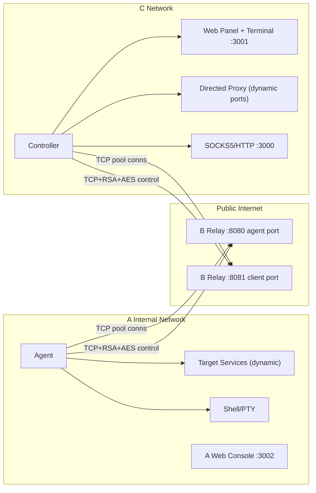
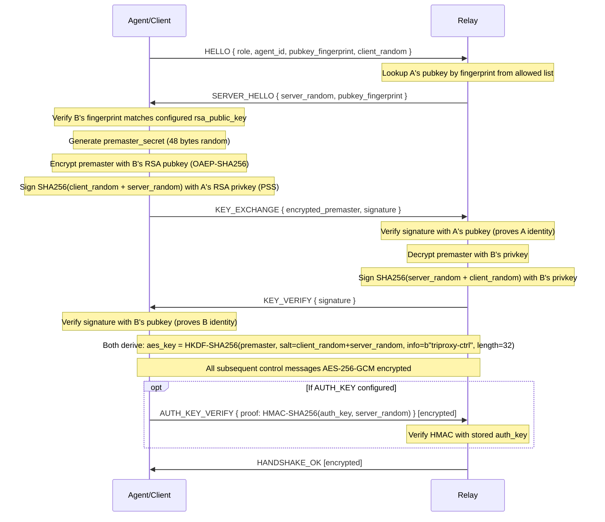
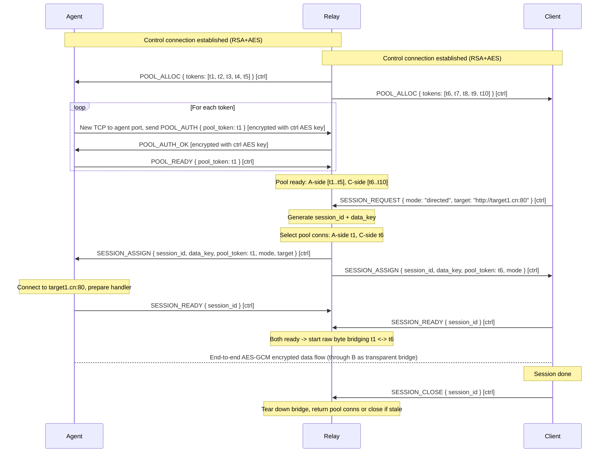
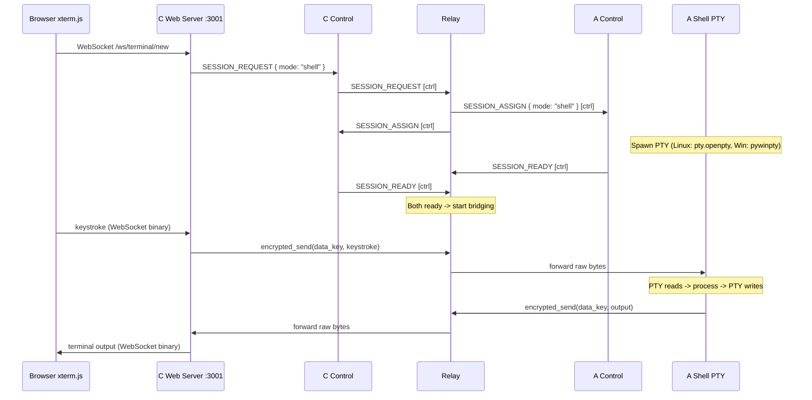
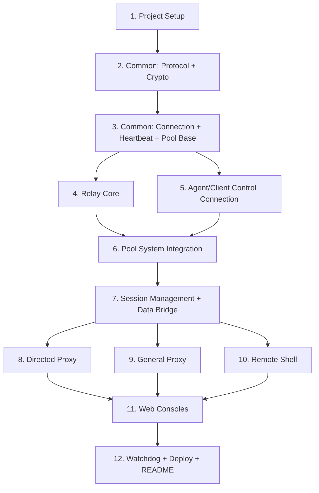

# TriProxy - Cross-Platform Encrypted Tunnel Proxy Implementation Plan

## Architecture Overview



- Directed Proxy ports are fully dynamic: rules can be added, modified, or removed at runtime via the C Web Panel, each rule creates/destroys a local TCP listener.
- Web Panel and Terminal share port 3001 as a single aiohttp application with different routes.
- A-side Target Services are determined per-session by the directed/general proxy request target.
- **Multi-tenant ready**: All B-side data structures are keyed by `agent_id`. Currently deployed as 1:1:1 (one A, one B, one C), but the protocol and relay internals use `agent_id` throughout to support future multi-agent expansion without architectural changes. The `allowed_agents` list in B's config can contain multiple agent fingerprints.

---

## Project Directory Structure

```
triproxy/
├── common/                      # Shared library (A/B/C all import)
│   ├── __init__.py
│   ├── protocol.py             # Wire framing + message type enums + JSON schemas
│   ├── crypto.py               # RSA load/sign/verify/encrypt, AES-GCM encrypt/decrypt, HKDF
│   ├── config.py               # YAML config loader with schema validation
│   ├── connection.py           # FramedConnection class (length-prefixed send/recv)
│   ├── heartbeat.py            # HeartbeatManager (async ping/pong, timeout detection)
│   ├── pool.py                 # BasePoolManager (pool logic, scaling, token tracking)
│   └── log.py                  # Structured logging setup (debug/info/warn/error)
├── agent/                       # A端 program
│   ├── __init__.py
│   ├── main.py                 # Entry point: load config, start subsystems, signal handling
│   ├── control.py              # AgentControlConnection (connect, handshake, msg loop, reconnect)
│   ├── pool.py                 # AgentPoolManager (extends BasePoolManager)
│   ├── session.py              # AgentSessionHandler (dispatch to proxy/shell)
│   ├── proxy.py                # ProxyHandler (connect target, AES-GCM encrypted bridge)
│   ├── shell.py                # ShellHandler (PTY on Linux, ConPTY on Windows)
│   ├── web_console.py          # A端 Web console (aiohttp, challenge-response auth)
│   └── watchdog.py             # Process watchdog (subprocess monitor + auto-restart)
├── relay/                       # B端 program
│   ├── __init__.py
│   ├── main.py                 # Entry point: start dual-port listeners
│   ├── listener.py             # AgentListener + ClientListener (accept, dispatch by first msg)
│   ├── handshake.py            # Server-side RSA mutual auth + AES key exchange
│   ├── control.py              # RelayControlManager (manage A & C control connections, multi-agent ready)
│   ├── pool.py                 # RelayPoolManager (track A-side & C-side pool conns)
│   ├── session.py              # SessionManager (create session, assign tokens, pair conns)
│   ├── bridge.py               # DataBridge (raw asyncio byte bridging between paired sockets)
│   └── watchdog.py
├── client/                      # C端 program
│   ├── __init__.py
│   ├── main.py                 # Entry point
│   ├── control.py              # ClientControlConnection (same pattern as agent)
│   ├── pool.py                 # ClientPoolManager (extends BasePoolManager)
│   ├── session.py              # ClientSessionManager (request sessions, track active)
│   ├── directed.py             # DirectedProxyManager (dynamic per-rule local TCP listeners)
│   ├── general.py              # GeneralProxy (SOCKS5 + HTTP CONNECT server)
│   ├── shell_client.py         # ShellClient (bridge WebSocket <-> encrypted session)
│   ├── web/                    # C端 Web application
│   │   ├── __init__.py
│   │   ├── app.py              # aiohttp app setup, route registration
│   │   ├── dashboard.py        # REST API: /api/status, /api/services, /api/directed/...
│   │   ├── terminal.py         # WebSocket: /ws/terminal/{session_id}
│   │   └── static/             # Frontend files
│   │       ├── index.html      # Redirect to /dashboard
│   │       ├── dashboard.html  # SPA dashboard (vanilla JS)
│   │       ├── terminal.html   # xterm.js terminal page
│   │       ├── css/
│   │       │   └── style.css
│   │       └── js/
│   │           ├── dashboard.js
│   │           ├── terminal.js
│   │           └── vendor/     # ALL third-party JS/CSS bundled locally (offline-ready)
│   │               ├── xterm.js            # xterm.js core
│   │               ├── xterm.css           # xterm.js styles
│   │               ├── xterm-addon-fit.js  # fit addon
│   │               ├── xterm-addon-web-links.js
│   │               └── sha256.min.js       # SHA256 lib for challenge-response auth
│   └── watchdog.py
├── certs/
│   ├── generate_keys.py        # RSA-2048 key pair generation (agent, relay, client)
│   └── README.md               # Key management instructions
├── deploy/
│   ├── systemd/
│   │   ├── triproxy-agent.service
│   │   ├── triproxy-relay.service
│   │   └── triproxy-client.service
│   ├── linux/                  # Shell scripts for non-systemd Linux environments
│   │   ├── install.sh          # Install dependencies, create dirs, set permissions
│   │   ├── start_agent.sh
│   │   ├── start_relay.sh
│   │   └── start_client.sh
│   ├── windows/
│   │   ├── install_agent.ps1
│   │   ├── install_relay.ps1
│   │   ├── install_client.ps1
│   │   ├── start_agent.bat     # Simple .bat wrappers for double-click launch
│   │   ├── start_relay.bat
│   │   └── start_client.bat
│   └── pm2/
│       └── ecosystem.config.js
├── config/
│   ├── agent.example.yaml
│   ├── relay.example.yaml
│   └── client.example.yaml
├── requirements.txt
└── README.md
```

---

## Dependencies (`requirements.txt`)

```
cryptography>=42.0.0
aiohttp>=3.9.0
pyyaml>=6.0.0
pywinpty>=2.0.0; sys_platform == "win32"
uvloop>=0.19.0; sys_platform != "win32"
```

- Target Python: 3.10+
- `cryptography` for RSA-2048, AES-256-GCM, HKDF
- `aiohttp` for Web server + WebSocket (A console + C panel + xterm.js)
- `pyyaml` for config
- `pywinpty` for Windows ConPTY (conditional, only on Windows)
- `uvloop` for Linux/Mac performance boost (conditional, only on non-Windows)

**Offline-ready frontend assets**: All third-party JavaScript/CSS libraries must be bundled locally in `client/web/static/js/vendor/` and `agent/web_console_static/vendor/` (or equivalent). No CDN references anywhere. This ensures the system works in fully air-gapped / offline internal networks. Libraries to bundle:

- xterm.js (core + CSS), xterm-addon-fit, xterm-addon-web-links (for C terminal)
- SHA256 JavaScript library (for A console challenge-response login and C remote password change)

---

## 1. Wire Protocol Specification (`common/protocol.py`)

### Frame Format

All TCP messages use length-prefixed framing:

```
+--------------------+-------------------+
| Length (4 bytes)   | Payload (N bytes) |
| big-endian uint32  |                   |
+--------------------+-------------------+
```

- Maximum frame size: 16 MB (`MAX_FRAME_SIZE = 16 * 1024 * 1024`)
- Payload is JSON (UTF-8) for control messages
- For encrypted control channel: `[12-byte nonce][ciphertext][16-byte GCM tag]` inside the payload

### Message Types (Enum)

```python
class MsgType(str, Enum):
    # --- Handshake (plaintext, control connection only, before AES key is established) ---
    HELLO = "HELLO"
    SERVER_HELLO = "SERVER_HELLO"
    KEY_EXCHANGE = "KEY_EXCHANGE"
    KEY_VERIFY = "KEY_VERIFY"
    AUTH_KEY_VERIFY = "AUTH_KEY_VERIFY"
    HANDSHAKE_OK = "HANDSHAKE_OK"
    HANDSHAKE_FAIL = "HANDSHAKE_FAIL"

    # --- Heartbeat (encrypted on ALL connections: control uses control AES key; pool uses control AES key) ---
    # Design: "所有经公网传输的数据均 AES 加密 + 随机 IV，明文不过网"
    PING = "PING"
    PONG = "PONG"

    # --- Pool management (encrypted, via control channel) ---
    POOL_ALLOC = "POOL_ALLOC"         # B -> A/C: "create N pool conns with these tokens"
    POOL_READY = "POOL_READY"         # A/C -> B: "pool conn with token X is ready"
    POOL_SHRINK = "POOL_SHRINK"       # B -> A/C: "close pool conn with token X"

    # --- Pool data connection auth (encrypted with control AES key, first msg on pool TCP conn) ---
    # Design: "所有经公网传输的数据均 AES 加密 + 随机 IV，明文不过网"
    # B determines which control AES key to use based on which port the connection arrived on
    # (agent port -> agent's control AES key, client port -> client's control AES key)
    POOL_AUTH = "POOL_AUTH"           # A/C -> B: authenticate pool connection
    POOL_AUTH_OK = "POOL_AUTH_OK"     # B -> A/C: pool conn accepted
    POOL_AUTH_FAIL = "POOL_AUTH_FAIL" # B -> A/C: rejected

    # --- Session management (encrypted, via control channel) ---
    SESSION_REQUEST = "SESSION_REQUEST"   # C -> B: request new session
    SESSION_ASSIGN = "SESSION_ASSIGN"     # B -> A and C: session created, here's your info
    SESSION_READY = "SESSION_READY"       # A/C -> B: I'm ready for this session
    SESSION_FAIL = "SESSION_FAIL"         # A -> B: can't handle this session (e.g. target unreachable)
    SESSION_CLOSE = "SESSION_CLOSE"       # any -> B: close session

    # --- Agent console remote management (encrypted, via control channel) ---
    AGENT_PWD_CHANGE = "AGENT_PWD_CHANGE"
    AGENT_PWD_CHANGED = "AGENT_PWD_CHANGED"
    AGENT_STATUS_REQ = "AGENT_STATUS_REQ"
    AGENT_STATUS_RESP = "AGENT_STATUS_RESP"
```

### Message JSON Schemas (key fields)

```python
# --- Handshake ---
# HELLO:            { type, version: "1.0", role: "agent"|"client", agent_id: str, pubkey_fingerprint: str, client_random: base64(32 bytes) }
# SERVER_HELLO:     { type, version: "1.0", server_random: base64(32 bytes), pubkey_fingerprint: str }
# KEY_EXCHANGE:     { type, encrypted_premaster: base64, signature: base64 }
# KEY_VERIFY:       { type, signature: base64 }
# AUTH_KEY_VERIFY:  { type, proof: base64 }
# HANDSHAKE_OK:     { type }
# HANDSHAKE_FAIL:   { type, reason: str }

# --- Heartbeat ---
# PING: { type, ts: float }
# PONG: { type, ts: float }

# --- Pool ---
# POOL_ALLOC:    { type, tokens: [str, ...] }          # list of hex tokens to create
# POOL_READY:    { type, pool_token: str }
# POOL_SHRINK:   { type, pool_token: str }
# POOL_AUTH:     { type, pool_token: str, role: "agent"|"client" }
# POOL_AUTH_OK:  { type }
# POOL_AUTH_FAIL:{ type, reason: str }

# --- Session ---
# SESSION_REQUEST: { type, mode: "directed"|"general"|"shell", target: str|null, agent_id: "default" }
# SESSION_ASSIGN:  { type, session_id: str, data_key: base64(32 bytes), pool_token: str, mode: str, target: str|null }
# SESSION_READY:   { type, session_id: str }
# SESSION_FAIL:    { type, session_id: str, reason: str }
# SESSION_CLOSE:   { type, session_id: str }

# --- Agent Console Remote ---
# AGENT_PWD_CHANGE:  { type, new_password_hash: str }      # SHA256 hex of new password
# AGENT_PWD_CHANGED: { type }
# AGENT_STATUS_REQ:  { type }
# AGENT_STATUS_RESP: { type, connected: bool, pool_size: int, active_sessions: int, uptime: float }
```

---

## 2. RSA Mutual Authentication + AES Key Exchange



### Crypto Implementation Details (`common/crypto.py`)

- **RSA Key Loading**: Load PEM files via `cryptography.hazmat.primitives.serialization`, compute SHA256 fingerprint of DER-encoded public key (hex string)
- **RSA Encrypt**: OAEP with SHA-256 and MGF1-SHA256 padding
- **RSA Sign**: PSS with SHA-256, max salt length
- **RSA Verify**: Corresponding verification functions
- **AES-256-GCM**: 12-byte random nonce, 128-bit tag; function signatures:
                - `aes_gcm_encrypt(key: bytes, plaintext: bytes) -> bytes` returns `nonce(12) + ciphertext + tag(16)`
                - `aes_gcm_decrypt(key: bytes, data: bytes) -> bytes` input is `nonce(12) + ciphertext + tag(16)`
- **HKDF**: `derive_key(premaster: bytes, salt: bytes, info: bytes, length: int = 32) -> bytes`
- **Token Generation**: `generate_token() -> str` returns 32-char hex string (16 bytes `os.urandom`)
- **Session Key Generation**: `generate_session_key() -> bytes` returns 32 bytes `os.urandom` (AES-256 key)
- **Fingerprint**: `pubkey_fingerprint(pubkey) -> str` returns SHA256 hex of DER-encoded public key

---

## 3. Connection Pool + Session Lifecycle

### Pool Architecture



### Pool Management Authority

**B (Relay) centrally controls all pool allocation decisions.** A and C are pool executors — they create/destroy TCP connections only when B instructs them. This design ensures:

- Token security: B generates all tokens, A/C never self-allocate
- Consistency: B has a single source of truth for pool state
- Multi-tenant ready: B can manage pools per-agent independently

Pool configuration lives **exclusively in B's relay config** (not in A/C configs). A/C have no pool tuning parameters.

### Pool Scaling Parameters (in relay config, with defaults)

```python
POOL_INITIAL_SIZE = 5             # Pool connections B allocates per side after handshake (warm-up)
POOL_MIN_IDLE = 0                 # Default 0: pool shrinks to zero when inactive
                                  # (design: "不活跃时可清零" — shorter token lifetime = more secure,
                                  #  no idle resource waste; burst perf mitigated by speculative alloc)
POOL_SCALE_BATCH = 5              # On demand: when pool is empty/low, B allocates this many at once
                                  # (speculative over-allocation for burst performance)
POOL_IDLE_TIMEOUT = 300           # Seconds idle before pool conn is closed (shrink toward 0)
POOL_SHRINK_CHECK_INTERVAL = 60   # Check for idle connections every N seconds
SESSION_SETUP_TIMEOUT = 30        # Seconds to wait for both SESSION_READY; abort session on timeout
# Note: No hard cap on pool size. Pool grows dynamically with demand.
# Only hardware resource exhaustion (fd limits, memory) can cap the pool.
```

### Pool Connection Lifecycle

1. **Creation (B-initiated)**: B sends `POOL_ALLOC { tokens: [...] } `via control channel -> A/C create TCP connections to B's port, send `POOL_AUTH { pool_token }` **encrypted with control channel AES key** (design: "明文不过网"), B determines which control AES key to use based on the receiving port (agent port -> agent's key, client port -> client's key), B responds `POOL_AUTH_OK` (also encrypted with control AES key), A/C confirm via control with `POOL_READY`
2. **Idle**: Pool connections sit idle; heartbeat via PING/PONG frames **encrypted with control channel AES key** directly on each pool connection to survive NAT/firewall timeouts (design: "所有经公网传输的数据均 AES 加密 + 随机 IV，明文不过网")
3. **Assignment**: B assigns a pool conn to a session -> heartbeat paused on that conn, B starts raw byte bridge
4. **Release**: Session ends -> if connection healthy, return to idle pool with heartbeat resumed; if unhealthy, close and B allocates replacement token via `POOL_ALLOC`
5. **On-demand scale-up (speculative over-allocation)**: When a `SESSION_REQUEST` arrives and idle pool count is low (< `POOL_SCALE_BATCH`), B simultaneously: (a) assigns one available conn to this session, (b) sends `POOL_ALLOC` with a fresh batch of `POOL_SCALE_BATCH` tokens to handle anticipated burst traffic. If pool is completely empty, B sends `POOL_ALLOC` first, waits for at least one `POOL_READY`, then assigns it. This means the first request after a long idle incurs a small delay (~100-200ms for TCP+auth), while subsequent burst requests are served instantly from the pre-allocated batch.
6. **Shrink to zero**: Idle connections that stayed idle > `POOL_IDLE_TIMEOUT` are closed; B sends `POOL_SHRINK` for each. With `POOL_MIN_IDLE=0` (default), pool shrinks completely to zero when inactive (design: "不活跃时可清零"). This maximizes security (shorter token lifetime) and saves resources.
7. **Pool exhaustion (hardware)**: Pool grows dynamically without software-imposed hard cap. Only true hardware resource exhaustion (OS file descriptor limits, memory) prevents new pool connections. If B cannot allocate pool connections for a session request, B responds with `SESSION_FAIL { reason: "pool_exhausted" }` and C may retry.
8. **Invalidation**: Control connection drops -> ALL pool connections for that agent/client closed immediately, all pool_token/session_id/data_key invalidated

### Session Setup Timeout

After B sends `SESSION_ASSIGN` to both A and C, both sides must respond with `SESSION_READY` within `SESSION_SETUP_TIMEOUT` (default 30s). If either side fails to respond in time:

- B cancels the session (sends `SESSION_CLOSE` to the side that did respond, if any)
- Pool connections are returned to idle or closed if unhealthy
- B responds with `SESSION_FAIL { reason: "setup_timeout" }` to C's original request

### Pool Encryption Note

All pool connections use the **control channel AES key** for encryption of management messages (POOL_AUTH, heartbeat PING/PONG). This differs from session data which uses the per-session `data_key` for end-to-end A-C encryption. The encryption layers are:

- **Control channel**: AES-GCM with control AES key (B can decrypt)
- **Pool idle/auth**: AES-GCM with control AES key (B can decrypt)
- **Session data**: AES-GCM with per-session data_key (B CANNOT decrypt — end-to-end A-C only)

This design ensures zero plaintext over public network while maintaining B's ability to manage pool connections without accessing session data.

---

## 4. Data Channel Encryption (A-C End-to-End)

B is a **transparent byte bridge** -- it copies raw bytes between paired pool connections without understanding or decrypting the content. A and C encrypt/decrypt end-to-end.

### Data Frame Format (inside the bridged TCP stream)

```
+--------------------+--------------+--------------------+
| Frame Length (4B)  | Nonce (12B)  | Ciphertext+Tag     |
| big-endian uint32  |              | (variable + 16B)   |
+--------------------+--------------+--------------------+
```

- **Frame Length** = 12 (nonce) + len(ciphertext) + 16 (GCM tag)
- **Encryption**: AES-256-GCM with `data_key` (unique per session, distributed via control channel)
- **Nonce**: 12 bytes random per frame (monotonic counter is also acceptable)
- **Plaintext payload**: raw bytes. **Important distinction by session mode**:
                - **Directed / General proxy sessions**: payload is **raw application data** (no type prefix, no framing inside — pure transparent byte stream)
                - **Shell sessions only**: payload uses a 1-byte type prefix (`0x00` = terminal I/O, `0x01` = resize command) — see Section 7 for details

### Data Flow Helper Functions

```python
# In common/crypto.py
async def encrypted_send(writer: asyncio.StreamWriter, data_key: bytes, plaintext: bytes):
    """Encrypt plaintext and send as a length-prefixed frame."""
    encrypted = aes_gcm_encrypt(data_key, plaintext)  # nonce + ciphertext + tag
    frame_len = len(encrypted).to_bytes(4, 'big')
    writer.write(frame_len + encrypted)
    await writer.drain()

async def encrypted_recv(reader: asyncio.StreamReader, data_key: bytes) -> bytes:
    """Receive a length-prefixed frame and decrypt."""
    frame_len_bytes = await reader.readexactly(4)
    frame_len = int.from_bytes(frame_len_bytes, 'big')
    if frame_len > MAX_FRAME_SIZE:
        raise ValueError("Frame too large")
    encrypted = await reader.readexactly(frame_len)
    return aes_gcm_decrypt(data_key, encrypted)
```

---

## 5. Mode 1: Directed Proxy (Dynamic Multi-Rule)

Design ref: "支持动态增删改，多定向规则并行运行"

### C端 (`client/directed.py`)

`DirectedProxyManager` class manages a dynamic set of directed rules. Each rule creates a local TCP listener.

**Startup**: For each rule in config `services.directed[]`, start a listener.

**Runtime dynamic management** (via C Web Panel API):

- **Add rule**: Create new `asyncio.start_server` on specified `local_port`, add to active rules set
- **Remove rule**: Close the server and all active sessions for that rule, remove from set
- **Update rule**: Stop old listener, start new one with updated target
- All changes persist to config file immediately

**Per-rule listener behavior**:

1. `asyncio.start_server` on `127.0.0.1:{local_port}`
2. On incoming local connection:

                        - Send `SESSION_REQUEST { mode: "directed", target: target_url }` via control channel
                        - Wait for `SESSION_ASSIGN` response (get `session_id`, `data_key`, `pool_token`)
                        - Locate the pool connection matching `pool_token`
                        - Send `SESSION_READY { session_id }` via control channel
                        - Bridge: local socket <-> `encrypted_send/recv(pool_conn, data_key)`

3. On local socket close or error: send `SESSION_CLOSE { session_id }` via control channel

### A端 (`agent/proxy.py`)

`ProxyHandler` class handles both directed and general proxy sessions identically:

1. Receive `SESSION_ASSIGN { mode: "directed"|"general", target, session_id, data_key, pool_token }`
2. Parse target (host, port from URL or host:port string)
3. `await asyncio.open_connection(host, port)` to the target service
4. If connection fails: send `SESSION_FAIL { session_id, reason }` via control
5. If success: send `SESSION_READY { session_id }` via control
6. Bridge: target socket <-> `encrypted_send/recv(pool_conn, data_key)`
7. On either side close/error: send `SESSION_CLOSE { session_id }`, cleanup both sides

---

## 6. Mode 2: General Proxy (SOCKS5 + HTTP CONNECT)

### C端 (`client/general.py`)

Start local server on `{general.bind}:{general.local_port}` (design default: `127.0.0.1:3000`; set `bind: "0.0.0.0"` to share with LAN users).

The server auto-detects protocol by peeking at the first byte:

- `0x05` -> SOCKS5
- ASCII letter -> HTTP proxy

**SOCKS5 Implementation** (RFC 1928, no-auth only):

1. Client greeting: expect `[0x05, N, methods...]` -> respond `[0x05, 0x00]` (no auth)
2. Client request: expect `[0x05, 0x01, 0x00, addr_type, addr, port]` -> parse target host:port
3. Send `SESSION_REQUEST { mode: "general", target: "host:port" }` via control
4. Wait for `SESSION_ASSIGN`, send `SESSION_READY`
5. Respond SOCKS5 success: `[0x05, 0x00, 0x00, 0x01, 0,0,0,0, 0,0]`
6. Bridge: local socket <-> encrypted pool conn

**HTTP CONNECT Implementation**:

1. Read `CONNECT host:port HTTP/1.1\r\n...\r\n\r\n`
2. Parse target host:port from request line
3. Same session creation flow as SOCKS5
4. Respond `HTTP/1.1 200 Connection Established\r\n\r\n`
5. Bridge: local socket <-> encrypted pool conn

**Plain HTTP Proxy**:

1. Read full HTTP request line + headers
2. Extract target host from `Host` header or absolute URL
3. Same session creation flow
4. Forward the entire original HTTP request bytes to A via encrypted channel
5. Bridge remaining data bidirectionally

### A端 (`agent/proxy.py`)

Identical to directed proxy -- `ProxyHandler` receives `SESSION_ASSIGN { mode: "general", target: "host:port" }`, connects to target, bridges. The code is shared.

---

## 7. Mode 3: Remote Shell / Web Terminal

### Architecture



### A端 Shell Handler (`agent/shell.py`)

```python
class ShellHandler:
    """Spawn and manage a shell PTY process."""

    async def start(self, session_id: str, data_key: bytes, pool_reader, pool_writer):
        if sys.platform == "win32":
            self._start_windows()   # pywinpty.PtyProcess.spawn("cmd.exe")
        else:
            self._start_linux()     # pty.openpty() + asyncio.create_subprocess_exec

        # Two concurrent asyncio tasks:
        # Task 1: PTY stdout -> encrypted_send(pool_writer, data_key, output_bytes)
        # Task 2: encrypted_recv(pool_reader, data_key) -> parse type prefix -> PTY stdin or resize
```

- **Linux**: `pty.openpty()` for master/slave fds + `asyncio.create_subprocess_exec(shell, stdin=slave, stdout=slave, stderr=slave)` where shell = `os.environ.get("SHELL", "/bin/bash")`
- **Windows**: `pywinpty.PtyProcess.spawn("cmd.exe")` or `powershell.exe`, read/write via pty file handles
- **Terminal resize** (**shell sessions only** — directed/general proxy sessions use raw payload without any type prefix): Within the encrypted data stream, use a 1-byte type prefix to distinguish data from control:
                - `0x00` + payload = terminal data (stdin/stdout)
                - `0x01` + JSON `{"cols": N, "rows": N}` = resize command
- **Shell exit**: When PTY process exits, send `SESSION_CLOSE` via control channel

### C端 Shell Client (`client/shell_client.py`)

```python
class ShellClient:
    """Bridge a WebSocket (xterm.js) to an encrypted shell session."""

    async def handle_websocket(self, ws, session_id, data_key, pool_reader, pool_writer):
        # Task 1: ws.receive() -> prepend 0x00 type prefix -> encrypted_send to pool
        # Task 2: encrypted_recv from pool -> strip type prefix -> ws.send()
        # Handle resize: ws sends JSON resize msg -> prepend 0x01 -> encrypted_send
```

### C端 Terminal Frontend (`client/web/static/terminal.html`)

- Load xterm.js + xterm-addon-fit + xterm-addon-web-links from local `vendor/` directory (all assets bundled locally, **no CDN** — must work offline)
- Connect WebSocket to `ws://127.0.0.1:3001/ws/terminal/{session_id}`
- xterm.js `onData` callback -> send keystroke bytes via WebSocket
- WebSocket `onmessage` -> `terminal.write(data)`
- Window resize / xterm fit -> send `{ "type": "resize", "cols": N, "rows": N }` via WebSocket
- Keyboard: xterm.js handles full mapping natively (Ctrl+C, Ctrl+Z, arrows, Tab, etc.)

---

## 8. A端 Web Console (`agent/web_console.py`)

Design ref: A端 Web 控制台 section

- **Framework**: aiohttp, bind to `127.0.0.1:{web_console_port}` (design default: 3002)
- **Routes**:
                - `GET /` -> login page (if not authenticated) or dashboard
                - `GET /api/nonce` -> return one-time random nonce for Challenge-Response
                - `POST /api/login` -> verify `SHA256(stored_hash + nonce)`, issue HttpOnly session cookie
                - `GET /api/status` -> JSON: connection state, pool info, active sessions count, uptime
                - `POST /api/connect` -> trigger connect/reconnect to B
                - `POST /api/disconnect` -> disconnect from B, close all sessions
                - `POST /api/password` -> change console password (receive `SHA256(new_password)` from client JS, store as new hash)
                - `GET /api/logout` -> clear session cookie

### Challenge-Response Login Flow (design: HTTP 安全登录)

```
1. Browser:  GET /api/nonce -> { nonce: "<random_hex_64>" }
2. Browser JS:  response = SHA256( stored_password_hash_unknown_to_browser + nonce )
   Actually: response = SHA256( SHA256(password_user_typed) + nonce )
3. Browser:  POST /api/login { response: "<hex>" }
4. Server:   verify response == SHA256( web_console_password_hash + nonce )
5. Server:   invalidate nonce (one-time use), issue session cookie
```

- **Password storage**: Config file stores `web_console_password_hash` = `SHA256(password)` as hex string
- **First boot**: If `web_console_password_hash` is empty string, show setup page to set initial password
- **Password change**: Client JS computes `SHA256(new_password)` and POSTs the hex; server stores it directly as the new `web_console_password_hash`; writes to config file immediately
- **Session management**: Random token stored server-side in memory dict `{token: expiry_time}`, cookie name `triproxy_session`, HttpOnly flag
- **C remote password change**: C sends `AGENT_PWD_CHANGE { new_password_hash }` through the encrypted control channel (A-B-C), A updates its stored hash and config file

### Static files

Minimal HTML + vanilla JS. The login page includes a locally bundled SHA256 JavaScript library (from `vendor/`, **no CDN** — must work offline) to compute the challenge-response client-side. No framework needed.

---

## 9. C端 Web Control Panel (`client/web/`)

Design ref: "与 Shell 服务共用 http://127.0.0.1:3001，同一应用路由"

- **Framework**: aiohttp, bind to `127.0.0.1:{services.shell.local_port}` (design default: 3001)
- **This is a single aiohttp application** serving both the dashboard and terminal on the same port
- **Authentication**: None for now. C panel defaults to binding `127.0.0.1` only, so it is only accessible from the local machine. This is a deliberate simplification for the current version. Authentication may be added in a future iteration if `bind: "0.0.0.0"` use cases require it. (Note: only A's web console requires challenge-response auth per design.)

### Routes

```
GET  /                              -> redirect to /dashboard
GET  /dashboard                     -> dashboard SPA (static HTML)
GET  /terminal                      -> terminal page (static HTML with xterm.js)

GET  /api/status                    -> overall system status JSON
GET  /api/services                  -> list all services and their state
POST /api/services/directed         -> add a new directed rule (start listener immediately)
PUT  /api/services/directed/{id}    -> update directed rule (restart listener)
DELETE /api/services/directed/{id}  -> remove directed rule (stop listener)
POST /api/services/{type}/toggle    -> enable/disable a service type (directed/general/shell)
GET  /api/sessions                  -> list active sessions (all types)
DELETE /api/sessions/{session_id}   -> kill a specific session

POST /api/terminal/new              -> create new shell session, return { session_id }
WS   /ws/terminal/{session_id}      -> xterm.js WebSocket bridge

POST /api/agent/password            -> remote change A's console password (sends AGENT_PWD_CHANGE via control channel)
```

### Config Persistence

Every config change via the API:

1. Update in-memory config object
2. Immediately apply the change (start/stop listener, toggle service, etc.)
3. Write full config back to the YAML file (overwrite with `yaml.dump`)

### Dashboard Frontend (`client/web/static/dashboard.html`)

- Vanilla JS SPA (no framework dependency)
- Sections:
                - **Connection Status**: B connection state (green/red), A connection state, pool stats (idle/active/total)
                - **Directed Proxy Rules**: Table with columns [ID, Local Port, Target URL, Enabled, Active Sessions, Actions]. Actions = Edit / Delete. "Add Rule" button opens inline form.
                - **General Proxy**: On/off toggle, port + bind display, active session count
                - **Shell Sessions**: List of active terminal sessions with "Kill" button per session, "New Terminal" button to open `/terminal`
- Auto-refresh: poll `GET /api/status` every 3 seconds to update indicators

---

## 10. Heartbeat System (`common/heartbeat.py`)

Design ref: "所有长连接（主控 + 池连接）统一心跳保活（100s）"

```python
class HeartbeatManager:
    """Manage heartbeat for a single connection."""

    def __init__(self, conn: FramedConnection, interval: int = 100, timeout: int = 300,
                 encrypt_key: bytes = None):
        self.conn = conn
        self.interval = interval   # Send PING every N seconds (design: 100s)
        self.timeout = timeout     # Declare dead if no PONG within N seconds
        self.encrypt_key = encrypt_key  # AES key for encrypting heartbeat frames
        # For control connections: encrypt_key = control AES key
        # For pool connections: encrypt_key = control AES key (same key, design: "明文不过网")

    async def run(self):
        """Start heartbeat loop. Raises ConnectionLost on timeout."""
        # Runs two concurrent tasks:
        # 1. Sender: await asyncio.sleep(self.interval), send PING { ts } (encrypted)
        # 2. Checker: track last_pong_time, if now - last_pong_time > self.timeout -> raise
```

- **Applies to**: control connections + idle pool connections
- **All heartbeats encrypted**: control connections use control AES key; pool connections also use control AES key (design: "明文不过网")
- **Pool connections in active session**: heartbeat paused (data is flowing, TCP keepalive sufficient)
- **Heartbeat failure on control connection**: triggers reconnection logic
- **Heartbeat failure on pool connection**: close it, B allocates replacement via `POOL_ALLOC`
- **interval = 100s** matches design's `heartbeat_interval: 100` and `heartbeat_timeout: 100`
- **dead_timeout = 300s** (3 missed heartbeats): if no PONG received within 300s, declare connection dead. This provides tolerance for transient network issues. Design's `heartbeat_timeout: 100` is the expected heartbeat period (matching `heartbeat_interval: 100`); the dead-detection window is deliberately 3x the period to avoid false positives.

---

## 11. Reconnection Logic

Design ref: "A/C 主动重连 B，重连后重新 RSA 认证，重建连接池"

### A and C Reconnection (`agent/control.py`, `client/control.py`)

```python
async def connection_loop(self):
    """Main loop with exponential backoff reconnection."""
    backoff = 1  # seconds
    max_backoff = 60
    while self.running:
        try:
            await self.connect_and_handshake()
            backoff = 1  # Reset on successful handshake
            await self.message_loop()  # Runs until connection drops
        except (ConnectionError, asyncio.TimeoutError, HandshakeError):
            self.logger.warning(f"Connection lost, reconnecting in {backoff}s")
            self._on_disconnect()  # Full cleanup
            await asyncio.sleep(backoff)
            backoff = min(backoff * 2, max_backoff)
```

### On Disconnect Cleanup (`_on_disconnect`)

1. Close all pool TCP connections (both idle and in-session)
2. Cancel all active session handlers (proxy bridges, shell PTY processes)
3. Invalidate all tokens in memory (pool_token, session_id, data_key)
4. After successful re-handshake: B sends fresh `POOL_ALLOC` to rebuild pool from scratch

---

## 12. Graceful Shutdown

All three components (A/B/C) must handle graceful shutdown on `SIGINT` / `SIGTERM` (or equivalent Windows signals). The shutdown sequence ensures clean resource release and no orphaned connections.

### Agent (A) Shutdown Sequence

```
1. Signal received (SIGINT/SIGTERM/Ctrl+C)
2. Set self.running = False (stops reconnection loop)
3. Send SESSION_CLOSE for all active sessions via control channel
4. Wait briefly (up to 2s) for in-flight session bridges to drain
5. Close all pool TCP connections
6. Close control connection to B (B detects disconnect, cleans up A's state)
7. Stop web console server
8. Stop PTY/shell subprocesses
9. Exit with code 0 (tells watchdog: intentional stop, don't restart)
```

### Relay (B) Shutdown Sequence

```
1. Signal received
2. Stop accepting new TCP connections on both ports
3. Send SESSION_CLOSE for all active sessions to both A and C
4. Wait briefly (up to 2s) for bridges to drain
5. Close all pool connections and control connections
6. Exit with code 0
```

### Client (C) Shutdown Sequence

```
1. Signal received
2. Set self.running = False
3. Stop all local listeners (directed proxy, general proxy, web panel)
4. Send SESSION_CLOSE for all active sessions via control channel
5. Wait briefly (up to 2s) for in-flight session bridges to drain
6. Close all pool TCP connections
7. Close control connection to B
8. Exit with code 0
```

### Implementation: `main.py` signal handling

```python
# In each component's main.py
loop = asyncio.get_event_loop()
for sig in (signal.SIGINT, signal.SIGTERM):
    loop.add_signal_handler(sig, lambda: asyncio.ensure_future(graceful_shutdown()))
# On Windows (no add_signal_handler support): use signal.signal() with a flag
```

---

## 13. Watchdog (`*/watchdog.py`)

Design ref: "自实现 watchdog 优先"

```python
class Watchdog:
    """Monitor and restart the main process on crash."""

    def __init__(self, target_module: str, config_path: str):
        self.target = target_module   # e.g., "agent.main"
        self.config_path = config_path

    def run(self):
        """Outer loop: spawn subprocess, restart on non-zero exit."""
        while True:
            proc = subprocess.Popen(
                [sys.executable, "-m", self.target, self.config_path]
            )
            exit_code = proc.wait()
            if exit_code == 0:
                break  # Clean intentional shutdown -> watchdog stops
            logger.error(f"Process crashed (exit={exit_code}), restarting in 3s")
            time.sleep(3)
```

- **Entry points**:
                - Production: `python -m agent.watchdog config/agent.yaml` (watchdog wraps main)
                - Development: `python -m agent.main config/agent.yaml` (direct, no watchdog)
- **Exit code 0** = intentional shutdown (e.g., user triggered disconnect+exit) -> watchdog exits cleanly
- **Non-zero exit** = crash -> watchdog restarts after 3 second delay
- **Enabled by**: `auto_restart: true` in config (design has this in all three configs)

---

## 14. RSA Key Generation (`certs/generate_keys.py`)

```python
def generate_keys(output_dir: str = "certs/"):
    """Generate RSA-2048 key pairs for agent, relay, and client."""
    from cryptography.hazmat.primitives.asymmetric import rsa
    from cryptography.hazmat.primitives import serialization

    for role in ["agent", "relay", "client"]:
        private_key = rsa.generate_private_key(
            public_exponent=65537, key_size=2048
        )
        # Write {role}_private.pem (PKCS8, no encryption)
        # Write {role}_public.pem (SubjectPublicKeyInfo PEM)
        # Print: "{role} fingerprint: SHA256:<hex>"
```

- **Output**: `agent_private.pem`, `agent_public.pem`, `relay_private.pem`, `relay_public.pem`, `client_private.pem`, `client_public.pem`
- **Usage**: `python certs/generate_keys.py --output certs/`
- **Fingerprint**: printed to stdout for configuring `allowed_agents` / `allowed_clients` on B

---

## 15. Configuration Schema

All key names below match the design document (`thoughts/design.md`) exactly. Keys not present in the design are marked with `# [ext]` to indicate they are implementation extensions.

### `config/agent.example.yaml`

```yaml
agent_id: "default"                            # Reserved for multi-tenant expansion
relay_host: "b.example.com"
relay_port_agent: 8080                         # B's agent port
rsa_private_key: "certs/agent_private.pem"
rsa_public_key: "certs/relay_public.pem"       # B's public key for mutual auth
auth_key: ""                                   # Optional pre-shared secret
web_console_port: 3002                         # A Web console port
web_console_bind: "127.0.0.1"                  # [ext] A Web console bind address
web_console_password_hash: ""                  # SHA256 hex; empty = first-boot setup
heartbeat_interval: 100
auto_restart: true
log_level: "info"
```

### `config/relay.example.yaml`

```yaml
bind_port_agent: 8080                          # Port accepting A connections
bind_port_client: 8081                         # Port accepting C connections
bind_host: "0.0.0.0"                          # [ext] Bind address for both ports
rsa_private_key: "certs/relay_private.pem"
allowed_agents:                                # A's public key files or fingerprints
  - "certs/agent_public.pem"                   # Accepts file path (loads key, computes fingerprint)
                                               # Also accepts raw fingerprint: "SHA256:abcdef..."
                                               # Design uses fingerprint format; file path is a convenience alias
allowed_clients:                               # C's public key files or fingerprints (for mutual auth)
  - "certs/client_public.pem"                  # Same format as allowed_agents
                                               # Design: "RSA-2048 双向验证" applies to BOTH A and C.
                                               # B must verify C's identity during handshake, just as it verifies A.
                                               # This is NOT an extension — it is required by the design's mutual auth spec.
auth_key: ""                                   # Optional pre-shared secret
pool:                                          # [ext] Pool tuning (B centrally controls all pool allocation)
  initial_size: 5                              # Connections per side after handshake (warm-up)
  min_idle: 0                                  # Default 0: pool shrinks to zero when inactive (design: "可清零")
  scale_batch: 5                               # On-demand: allocate this many at once for burst handling
  idle_timeout: 300                            # Seconds idle before pool conn is closed
  shrink_check_interval: 60                    # Check for idle connections every N seconds
  session_setup_timeout: 30                    # Seconds to wait for both SESSION_READY
heartbeat_timeout: 100                         # Expected heartbeat period from A/C
dead_timeout: 300                              # [ext] Declare connection dead after this many seconds without PONG
auto_restart: true
log_level: "info"
```

### `config/client.example.yaml`

```yaml
relay_host: "b.example.com"
relay_port_client: 8081                        # B's client port
rsa_private_key: "certs/client_private.pem"
rsa_public_key: "certs/relay_public.pem"       # B's public key for mutual auth
auth_key: ""                                   # Optional pre-shared secret

services:
  directed:                                    # Dynamic rules: can be added/removed at runtime via web panel
    - id: "rule1"                              # [ext] Unique rule ID for API operations
      local_port: 3005
      target_url: "http://target1.cn:80"
      enabled: true
  general:
    local_port: 3000
    bind: "0.0.0.0"                            # [ext] Bind address; 0.0.0.0 = share with LAN users
    enabled: true
  shell:
    local_port: 3001                           # Also serves web control panel (/dashboard, /terminal)
    enabled: true

heartbeat_interval: 100
auto_restart: true
log_level: "info"
```

### Design-vs-Plan Config Key Mapping

| Design Key | Plan Key | Notes |

|---|---|---|

| `relay_port_agent` | `relay_port_agent` | Exact match |

| `rsa_public_key` | `rsa_public_key` | Exact match |

| `web_console_port` | `web_console_port` | Exact match |

| `web_console_password_hash` | `web_console_password_hash` | Exact match |

| `bind_port_agent` | `bind_port_agent` | Exact match |

| `bind_port_client` | `bind_port_client` | Exact match |

| `allowed_agents` | `allowed_agents` | Exact match (key); value supports both file path and fingerprint string |

| `relay_port_client` | `relay_port_client` | Exact match |

| `heartbeat_interval` | `heartbeat_interval` | Exact match (100) |

| `heartbeat_timeout` | `heartbeat_timeout` | Exact match (100) |

| `auto_restart` | `auto_restart` | Exact match (true) |

| (not in design) | `pool.*` (relay only) | Extension for pool tuning; B centrally controls pool allocation |

| (not in design) | `bind_host`, `web_console_bind`, `bind` | Extension for bind addresses |

| (not in design) | `services.directed[].id` | Extension for API CRUD operations |

| (implicit in design) | `allowed_clients` | Design says "RSA-2048 双向验证" — B must verify C too, not only A |

---

## 16. Implementation Order (Critical Path)



**Key constraints**:

- Tasks 8, 9, 10 (three proxy modes) can be parallelized
- Task 11 (Web UIs) can start as soon as any one proxy mode works end-to-end
- Each task should be testable independently before proceeding

---

## 17. Single-Machine Debug Support

Design ref: "agent/relay/client 可在同一主机运行进行功能调试"

All three components must be runnable on one machine for development:

```bash
# Terminal 1: Generate keys (one-time)
python certs/generate_keys.py --output certs/

# Terminal 2: Start relay
python -m relay.main config/relay.yaml

# Terminal 3: Start agent (connects to localhost:8080)
python -m agent.main config/agent.yaml

# Terminal 4: Start client (connects to localhost:8081)
python -m client.main config/client.yaml
```

Debug configs should default to:

- `relay_host: "127.0.0.1"` in agent and client configs
- `log_level: "debug"` in all configs
- `bind_host: "127.0.0.1"` in relay config